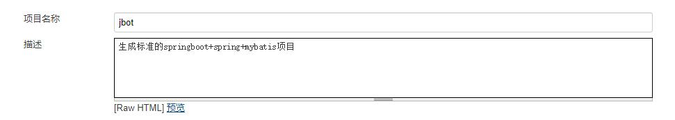
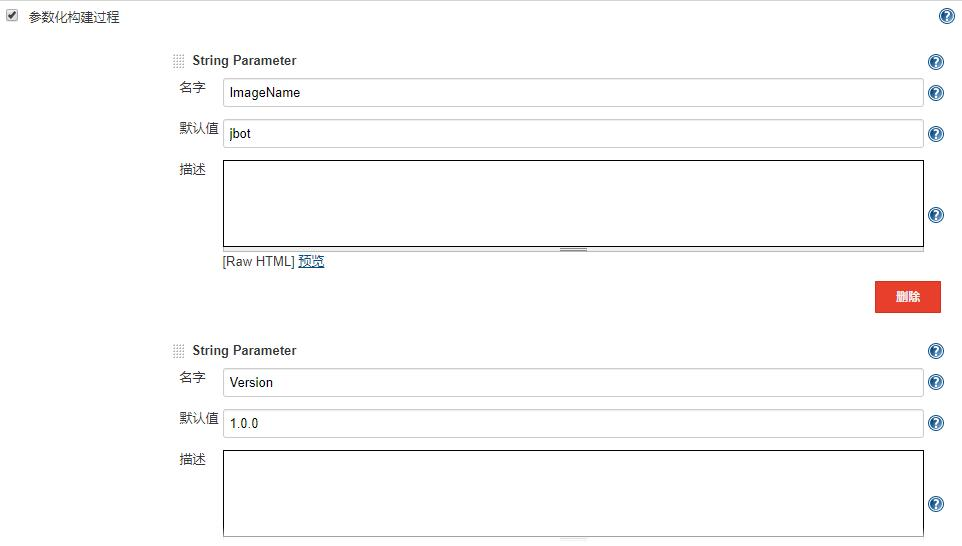
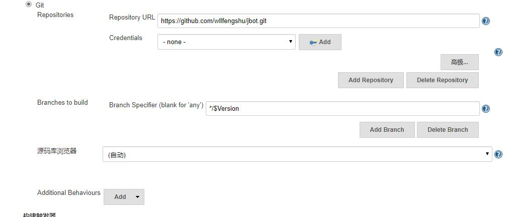
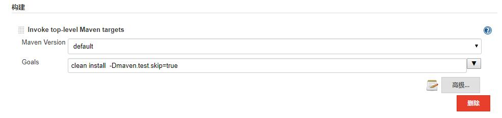
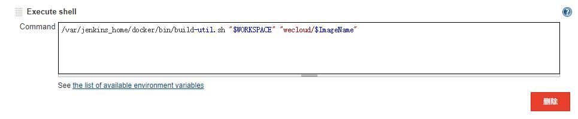

# jbot部署教程

> 本教程介绍jbot的四种运行方式 
> - 1、使用IDEA运行
> - 2、使用Eclipse运行
> - 3、使用Maven命令行打包并运行
> - 4、使用Jenkins打包并运行

## 1、使用IDEA运行

- 下载jbot后，在JbotApplication中右键即可启动

## 2、使用Eclipse运行

- 下载jbot后，在JbotApplication中右键即可启动

## 3、使用Maven命令行打包并运行

> - os：windows
> - maven：apache-maven-3.5.2
> - 打包方式：生成可执行的jar,所有资源文件都在jar中
> - 注意：maven具体使用方法请自行百度

##### 3.1 下载jbot后，使用命令行工具进入jbot目录中

##### 3.2 执行打包命令：
```shell
mvn clean package
```

##### 3.3 打包完毕后，进入到jbot/target目录中启动jbot
```shell
java -jar jbot-1.0-SNAPSHOT.jar --db_url=jdbc:mysql://127.0.0.1:3306/test --db_username=root --db_password=root
```

- 本jar下载地址：  
链接： [https://pan.baidu.com/s/1TNN0SZkuaZOvsmn9wx5jeA](https://pan.baidu.com/s/1TNN0SZkuaZOvsmn9wx5jeA "https://pan.baidu.com/s/1TNN0SZkuaZOvsmn9wx5jeA")  
提取码：j62x 

## 4、使用Jenkins打包并运行

> - os：windows
> - jenkins：1.642.4
> - 打包方式：生成docker镜像
> - 注意：jenkins具体使用方法请自行百度

##### 4.1 设置项目名


##### 4.2 设置镜像名和版本号


##### 4.3 设置git


##### 4.4 设置maven构建参数


##### 4.5 设置shell构建参数


